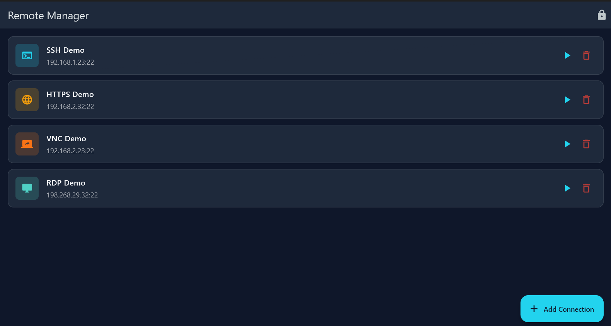
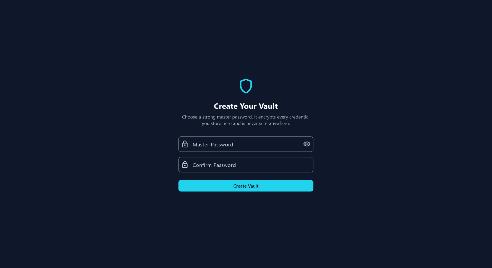
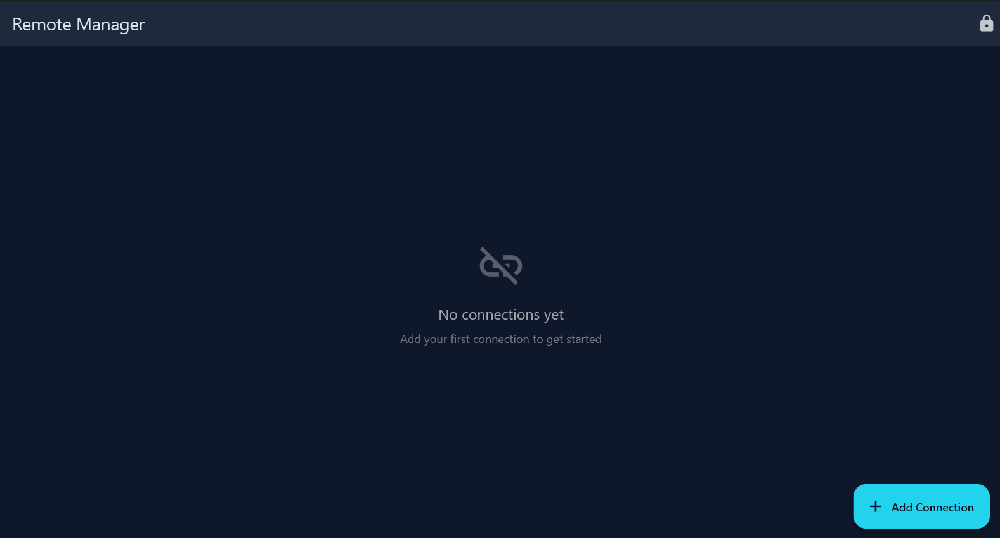
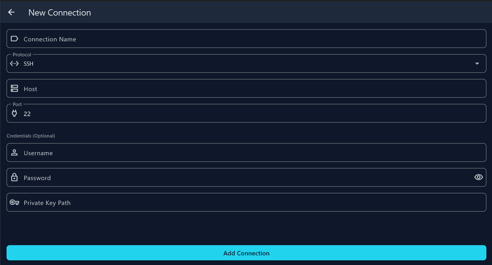
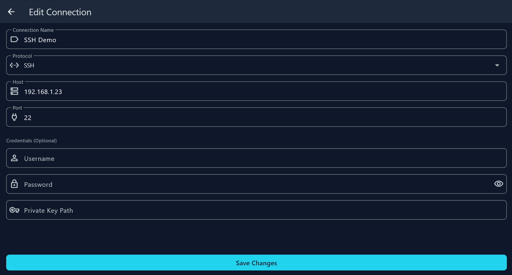
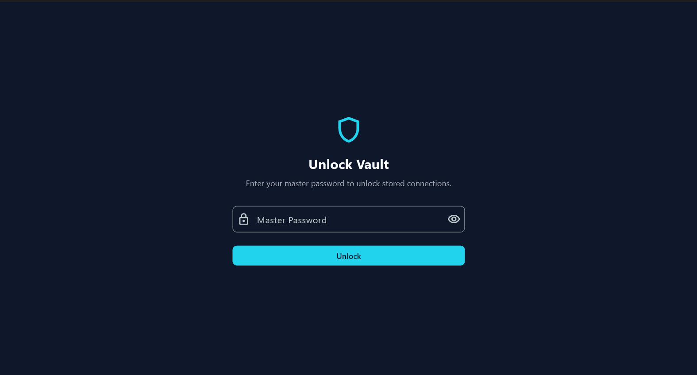

# KRemote

An open-source, cross-platform remote connection manager inspired by mRemoteNG but built from the ground up to work on Windows, Linux, macOS, iOS, and Android.

## Screenshots

<div align="center">
  
  <p><em>Manage all your remote connections in one place</em></p>
</div>

<details>
<summary>More screenshots</summary>

### Vault Creation


### Empty Home Screen


### Add Connection


### Home with Connections


### Connection Details


### After Logout (Vault Locked)


</details>

## Download

Pre-built binaries are available on the [Releases page](https://github.com/z41hk/KRemote/releases).

**Latest: v0.1.0-alpha (Windows x64)**
- Download `KRemote-v0.1.0-alpha-windows-x64.zip`, extract, and run `kremote.exe`
- No installation required (portable)
- This is an early alpha — expect rough edges and breaking changes between releases

## Project Vision

A unified connection manager supporting multiple protocols:
- **SSH** - Secure Shell terminal connections
- **RDP** - Remote Desktop Protocol
- **VNC** - Virtual Network Computing
- **HTTP/HTTPS** - Web protocols
- **VPN** - Virtual Private Networks (WireGuard integration planned)
- **AnyDesk-style remote control** (future milestone)

## Current Status: Early MVP

This is an active work-in-progress. What's working today:

### ✅ Implemented
- **Encrypted credential vault** with master password protection (Argon2id + AES-256-GCM)
- **Cross-platform architecture** using Flutter (UI) + Rust (crypto/network/protocol logic)
- **Connection management**: add, edit, delete, organize connections with folders and tags
- **SSH connection testing** via libssh2 (password and SSH key authentication)
- **Multi-protocol support** foundation (SSH, RDP, VNC, HTTP/HTTPS, VPN)
- **Import/export** functionality for connection backup and migration
- **Vault operations**: create, unlock, lock, auto-save on changes
- **Modern UI** with dark slate theme (#0F172A), protocol-specific icons/colors
- **VNC client stub** ready for libvncclient integration

### 🚧 In Progress / Planned
- Full SSH terminal emulation (currently just connection testing)
- RDP client integration (via FreeRDP)
- VNC client integration (via LibVNCServer) - stub implemented
- HTTP/HTTPS launcher (URL launcher ready)
- VPN profile management (WireGuard)
- Jump host / bastion SSH tunneling (field added to connection model)
- Session recording and audit logs
- Mobile apps (Android/iOS) - architecture is ready, UI needs mobile adaptation
- Team vaults with shared credentials (zero-knowledge sync)
- Plugin system for extending protocol support

## Architecture

```
┌─────────────────────────────────────┐
│         Flutter (Dart)              │  <- Cross-platform UI
│  Windows / Linux / iOS / Android    │
└──────────────┬──────────────────────┘
               │ flutter_rust_bridge (FFI)
┌──────────────▼──────────────────────┐
│           Rust Core                 │  <- Business logic, crypto, protocols
│  • Vault (Argon2, AES-GCM)          │
│  • SSH (libssh2)                    │
│  • RDP (FreeRDP - TODO)             │
│  • VNC (libvncclient - TODO)        │
└─────────────────────────────────────┘
```

- **Flutter** handles the UI layer and platform-specific packaging
- **Rust** handles encryption, credential storage, SSH/RDP/VNC protocol implementations
- **flutter_rust_bridge** generates type-safe FFI bindings automatically

### Why Flutter + Rust?

1. **Flutter**: Write UI once, deploy to Windows/Linux/iOS/Android
2. **Rust**: Memory-safe, fast, excellent crypto/networking libraries (no need to reinvent RDP/SSH/VNC stacks)
3. **FRB**: Seamless Dart↔Rust interop with async/await support

## Technology Stack

| Layer | Technology |
|-------|-----------|
| UI Framework | Flutter 3.x |
| Core Logic | Rust (stable) |
| FFI Bridge | flutter_rust_bridge 2.x |
| Encryption | Argon2id (password hashing), AES-256-GCM (vault encryption) |
| SSH | libssh2 |
| RDP | FreeRDP (planned) |
| VNC | LibVNCServer/libvncclient (planned) |
| VPN | WireGuard (wireguard-go / wireguard-rs, planned) |

## Building from Source

### Prerequisites

1. **Flutter SDK** (3.13+): https://flutter.dev/docs/get-started/install
2. **Rust toolchain** (stable): https://rustup.rs
3. **Platform-specific build tools**:
   - Windows: Visual Studio 2022 Build Tools (C++ desktop workload)
   - Linux: `build-essential`, `libssh2-1-dev`, `pkg-config`
   - macOS: Xcode command-line tools
4. **flutter_rust_bridge codegen**:
   ```bash
   cargo install flutter_rust_bridge_codegen
   ```

### Build Steps

```bash
# Clone the repository
git clone https://github.com/z41hk/KRemote.git
cd KRemote

# Get Flutter dependencies
flutter pub get

# Generate Rust↔Dart bindings
flutter_rust_bridge_codegen generate

# Run on your platform
flutter run -d windows   # Windows
flutter run -d linux     # Linux
flutter run -d macos     # macOS

# Build release binary
flutter build windows --release
flutter build linux --release
flutter build apk --release   # Android
flutter build ios --release   # iOS (requires macOS + Xcode)
```

## Project Structure

```
kremote/
├── lib/                      # Flutter/Dart code
│   ├── main.dart             # App entry point
│   ├── screens/              # UI screens
│   │   ├── home_screen.dart
│   │   ├── vault_screen.dart
│   │   └── connection_detail_screen.dart
│   └── src/rust/             # Auto-generated Rust bindings
│       ├── api/              # API surface (generated by FRB)
│       └── frb_generated.dart
├── rust/                     # Rust core
│   ├── src/
│   │   ├── api/              # Public API exposed to Flutter
│   │   │   ├── app.rs        # High-level app functions
│   │   │   ├── vault.rs      # Vault operations
│   │   │   ├── models.rs     # Data models (Connection, etc.)
│   │   │   ├── ssh.rs        # SSH protocol (libssh2 wrapper)
│   │   │   ├── vnc.rs        # VNC protocol stub
│   │   │   └── import.rs     # Import/export functions
│   │   └── lib.rs
│   └── Cargo.toml
├── windows/                  # Windows runner (C++)
├── linux/                    # Linux runner (C++)
├── android/                  # Android project
├── ios/                      # iOS project
└── pubspec.yaml              # Flutter dependencies
```

## Security Model

### Vault Encryption

1. **Master password** → Argon2id (time=3, memory=64MB, parallelism=4) → 32-byte key
2. **Data encryption**: AES-256-GCM (authenticated encryption)
3. **Vault file format** (JSON):
   ```json
   {
     "version": 1,
     "salt": "<hex>",           // 32-byte random salt for Argon2
     "password_hash": "<hex>",  // Argon2(password + salt) for verification
     "nonce": "<hex>",          // 12-byte random nonce for AES-GCM
     "ciphertext": "<hex>",     // Encrypted connections JSON
     "tag": "<hex>"             // 16-byte GCM authentication tag
   }
   ```
4. **No plaintext storage**: Passwords are never written to disk unencrypted
5. **Memory protection**: Sensitive data cleared on vault lock (Rust's `Drop` trait)

### Threat Model

- **Protected against**: offline vault file theft (strong encryption), casual inspection, memory dumps after lock
- **Not protected against**: keylogger capturing master password, memory dump while unlocked, malicious Rust/Flutter code in dependencies
- **Future**: Hardware key support (FIDO2/YubiKey), OS keychain integration for master password

## Usage

### First Run

1. Launch the app
2. Create a new vault with a strong master password (min 8 characters)
3. The vault file is saved to:
   - Windows: `%APPDATA%\kremote\vault.enc`
   - Linux: `~/.config/kremote/vault.enc`
   - macOS: `~/Library/Application Support/kremote/vault.enc`

### Adding Connections

1. Click **+ Add Connection**
2. Fill in:
   - **Name**: Display name (e.g., "Production Server")
   - **Protocol**: SSH, RDP, VNC, HTTP, HTTPS, VPN
   - **Host**: IP or hostname
   - **Port**: Default is auto-filled per protocol
   - **Credentials**: Username, password, or SSH private key path
   - **Folder**: Optional folder ID for organization
   - **Tags**: Comma-separated tags (e.g., "production,linux,web")
   - **Jump Host**: Optional bastion/jump host ID for tunneling
   - **Notes**: Free-text notes for documentation
3. Click **Save** to store the connection

### Testing Connections

- Click the ▶ (play) button on any connection card
- For SSH: attempts to connect and run `echo "Connection test successful"`
- Result shown in a snackbar (green = success, red = failure)

### Locking the Vault

- Click the 🔒 lock icon in the app bar
- All decrypted data is cleared from memory
- You'll need to re-enter your master password to unlock

## Roadmap

### Phase 1: MVP
- [x] Vault with AES-256-GCM encryption
- [x] Connection CRUD (create, read, update, delete)
- [x] SSH connection testing
- [x] Windows build working
- [ ] Linux build verification
- [ ] Full SSH terminal emulation

### Phase 2: Protocol Expansion
- [ ] RDP client integration (FreeRDP)
- [x] VNC module scaffolded (stub - needs libvncclient FFI bindings)
- [x] HTTP/HTTPS launcher (opens system browser)
- [x] Jump host SSH tunneling (data model + auth flow; full TCP tunnel via `channel_direct_tcpip` pending)

### Phase 3: Mobile
- [ ] Android app (UI adaptation for touch)
- [ ] iOS app
- [ ] Mobile-specific features (biometric unlock)

### Phase 4: Advanced Features
- [x] Connection folders (hierarchical, with rename/delete)
- [x] Connection tags
- [x] Import from mRemoteNG XML
- [x] Export vault to plaintext JSON (manual backup)
- [ ] Session recording/playback
- [ ] Team vaults with cloud sync (E2E encrypted)
- [ ] WireGuard VPN profile management
- [ ] Plugin/extension system

### Phase 5: Enterprise
- [ ] LDAP/AD integration
- [ ] Audit logs and compliance reports
- [ ] Role-based access control (RBAC)
- [ ] Self-hosted sync server

See [STATUS.md](STATUS.md) for a detailed, up-to-date breakdown of what's implemented vs. stubbed vs. planned.

## Contributing

This project is fully open source! Contributions welcome:

1. Fork the repository
2. Create a feature branch (`git checkout -b feature/amazing-feature`)
3. Commit your changes (`git commit -m 'Add amazing feature'`)
4. Push to the branch (`git push origin feature/amazing-feature`)
5. Open a Pull Request

### Development Guidelines

- **Rust code**: Run `cargo fmt` and `cargo clippy` before committing
- **Flutter code**: Run `flutter analyze` and `dart format .`
- **Bindings**: Regenerate with `flutter_rust_bridge_codegen generate` after changing Rust API
- **Testing**: Add tests for new Rust modules (`cargo test`)

## License

MIT License - see [LICENSE](LICENSE) for details.

## Acknowledgments

Inspired by:
- [mRemoteNG](https://github.com/mRemoteNG/mRemoteNG) - The original Windows-only connection manager
- [Apache Guacamole](https://guacamole.apache.org/) - Clientless remote desktop gateway
- [RustDesk](https://github.com/rustdesk/rustdesk) - Open-source remote desktop solution
- [Remmina](https://remmina.org/) - Linux GTK+ remote desktop client

Built with:
- [Flutter](https://flutter.dev/)
- [Rust](https://www.rust-lang.org/)
- [flutter_rust_bridge](https://github.com/fzyzcjy/flutter_rust_bridge)
- [libssh2](https://www.libssh2.org/)

## Support

- **Issues**: [GitHub Issues](https://github.com/z41hk/KRemote/issues)
- **Discussions**: [GitHub Discussions](https://github.com/z41hk/KRemote/discussions)

---

**Status**: 🚧 Active Development | **License**: MIT | **Platforms**: Windows, Linux, macOS, iOS, Android (cross-platform)
